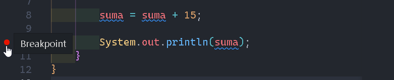
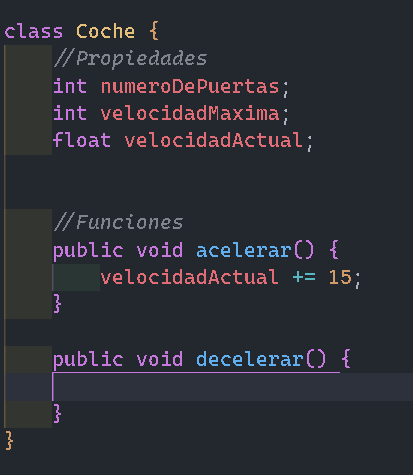
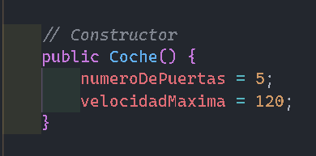
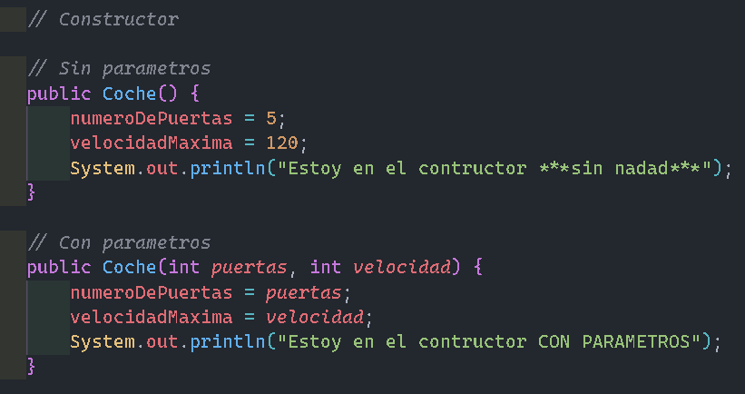

# Introduccion a la programacion

<br>

## Tipos de datos complejos

### Caracter

```
caracter = 'a';
```

### String (Texto)

```
//es una secuencia de caracteres
texto = "hola";
```

### Numerico

```
numeros = 321;
```

### Float

```
numeroFloat = 321.123
```

---

<br>

## Arrays

#### Hay diferentes tipos de Arrays :

- Array de caracter

```
 arrayChar = ['a','b','c','d'];
```

- Array de string

```
 arrayString = ['Hola','chau'];
```

- Array de numeros

```
 arrayChar = [0, 1, 2, 3];
```

- Array de numero float

```
 arrayChar = ['1.1','2.3','3.32','4.23'];
```

#### Los Array tienen que tener el `mismo tipo de dato` en la misma.

```
  arraysInvalido = ['a',"texto",10,3.5]
```

#### Los tipos compuestos a su vez pueden ser `doblemente compuestos`, es decir, que puedo tener un `Array` dentro de otro `Array`.

```
arrayArray = [
    [1, 2, 3],
    [4, 5, 6]
]

//A estos tipos de Array se los
conoce como bidimensional
porque tiene dos dimensiones.
```

---

<br>

## Tupla

#### Una Tupla suele ser similar a un Array pero con una diferencia, es decir, que los elementos de un `Array son variables o mutables` y las de una `Tupla son invariable o inmutable`.

```
tupla = (a, b, c) 0 (a => 1, b => 2, c => 3 )
```

#### Mapa asociativo o array asociativo son compuestos.

```
arrayAsociatiivo = ["clave" => valor]
```

#### Ejemplo:

```
arrayCapitalesPais =[
    "San Juan" => "San Juan",
    "Cordoba" => "Cordoba"
    ]
```

---

<br>

# Objetos o Cajas

#### Un objeto es algo que en la logica de nuestro programa intenta representar el mundo real.

### <strong>`Pseudocodigo`</strong>

```
Objeto:
    Propiedades:
        - Color: blanco
        - Forma: rectangular
    Metododos:
        - Pueden hacer algo
```

#### Ejemplo:

```
Jueguete:
    Propiedades:
        - Color: marron
        - Forma: patata
    Metododos:
        - Poner Sombrero
        - Quitar brazo
```

<br>

# Consejos y curiosidades sobre tipos de datos

#### Cuando creamos una cadena de texto siempre termina con el caracter `NULL` que es un `0` que significa `fin de cadena de texto`.

```
nombre = "Victor" + 0
```


#### Las cadenas de texto son un `Array` de caracteres

```
arrayCaracteres = ['V', 'i', 'c', 't', 'o', 'r', 0]
```

---

<br>

# Condicionales

## LOGICAS BOOLEANA

- "Y" `(&&)`
- "O" `(||)`

```
(40 MAYOR QUE 30) Y (30 MENOR QUE 50)
       SI         &&       SI
                  SI

(40 MAYOR QUE 30) O (30 MENOR QUE 50)
       SI         ||       SI
                  SI
```

### COMPARATIVAS

- "MAYOR QUE" `(>)`
- "MENOR QUE" `(<)`
- "MAYOR O IGUAL QUE" `(>=)`
- "MENOR O IGUAL QUE" `(<=)`
- "IGUAL A" `(==)`

#### Las condiciones tienen solamente dos resultados: `True` o `False`

### Ej:

```
40 > 30 => true
40 < 30 => false
```

---

<br>

## Condicional `SI` o `IF`

### <strong>`Pseudocodigo`</strong>

```
VAR ESTACION = "VERANO"

SI (ESTACION IGUAL A "VERANO") ENTONCES
    AQUI LAS ACCIONES A TOMAR
    BEBER_AGUA()
    TOMARSE_UN_MOGITO()
    IRSE_AL_BAR()
```

### Tiene que cumplirse la condicion para seguir la acciones a tomar.

```
VAR ESTACION = "INVIERNO"

SI (ESTACION IGUAL A "VERANO") ENTONCES
    AQUI LAS ACCIONES A TOMAR
    BEBER_AGUA()
    TOMARSE_UN_MOGITO()
    IRSE_AL_BAR()
EN CASO CONTRARIO SI (ESTACION IGUAL A "PRIMAVERA") ENTONCES
    SALIR_DE_PASEO()
EN CASO DE CONTRARIO ENTONCES
    VER_NETFLIX()
```

En este caso no se cumplio las dos primera entonces quedo con la ultima condicion. Esa forma de representarlo se lo llama `Pseudocódigo`.

_Ejemplo en [codigo](./ejercicio/app/src/condicional.java)_

---

<br>

# Bucles

Bucle es hacer algo un numero determinado de veces hasta que la condicion se cumpla.

---

<br>

- ## `While`

Solo se pasa a ejecutar su contenido si se comprueba la condición.

### <strong>`Pseudocodigo`</strong>

```
VAR CONTADOR = 10

MIENTRAS (CONTADOR MAYOR A CERO)
    RESTA UNO AL CONTADOR

    SIGO POR AQUI
```

_Ejemplo en [codigo](./ejercicio/app/src/countWhile.java)_

<br>

- ## `Do while`

Funciona de forma similar, solo que nos aseguramos de que el contenido sea ejecutado al menos una vez, es decir que aunque su condición no se cumpla, su contenido se ejecuta.

### <strong>`Pseudocodigo`</strong>

```
Haz
  RESTA UNO AL CONTADOR

MIENTRAS(CONTADOR SEA MAYOR QUE 10)
```

_Ejemplo en [codigo](./ejercicio/app/src/countDoWhile.java)_

<br>

- ## `For`

Es el bucle que mas vamos a usar en todos los programas.

El bucle repititivo tiene tres partes la de declaracion e inicializacion, comparacion y la de accion. En algunos lenguajes las tres obligatorias y en otras ninguna obligatoria.

### <strong>`Pseudocodigo`</strong>

```
"PARA"(INICIALIZACION;COMPARACION;ACCION)

"PARA"(CONTADOR MAYOR QUE 0; CONTADOR IGUAL A CONTADOR MENOS 1)
   IMPRIME EL VALOR DE LA VARIABLE CONTADOR
```

Otra explicacion:

```
VAR VALORES = |10|20|30|40|50|60|
                0  1  2  3  4  5

    PARA (POSICION_EN_ARRAT=0; POSICION_EN_ARRAY < LONGITUD_DEL_ARRAY; POSICION++)
        IMPRIME EL VALOR DE LA POSICIONA CTUAL EN EL ARRAY
```

_Ejemplo en [codigo](./ejercicio/app/src/countFor.java)_

<br>

## Cuando se ocupa un `For` o un `While`?

Los `For` se utilizan tipicamente cuando se quiere recorrer un Array o tipos de datos compuestos y un `While` para comparaciones de true o false.

- `For`

```
    int valores[] = new int[5];

    for (i = 0; i < valores.length; i++ ){
        System.out.println(valores[i]);
    }
```

- `While`

```
    var temperatura = 14;

    while (tempretatura != 15) {
        System.out.println(temperatura)
    }
```

---

<br>

- ## `Switch Case`
  Un interruptor es una forma de control.

### <strong>`Pseudocodigo`</strong>

```
VAR ESTACION = "VERANO"

DICIERNTE(ESTACION)
    CASO "VERANO"
        IMPRIMIR "ES VERANO"
    RUPTURA
    CASO "INVIERNO"
        IMPRIMIR "ES INVIERNO"
    RUPTURA
    DEFECTO
        imprime la estacion de la variable
    RUPTURA
```

_Ejemplo en [codigo](./ejercicio/app/src/switchCase.java)_

---

<br>

# Gestion de errores

Errores que se comente casi siempre como programador.

- `Primero:` Nombrar mal una `variable`.

  Imaginemos que tenemos que hacer un una variable que sea un `contador`.Como lo llamariamos?

  ```
  //BIEN
    var contador = 0;

  //MAL
    var foo = 0;
    var bar = 0;
    var foobar = 0;
  ```

  El codigo tiene que ser legible, por esto, la `variable` tiene que llevar el nombre de su funcion.

  Hay excepciones a esta regla utilizando bucle `for` esta permitido y no es una mala practica utilizar `variables` con nombre `"i"`, `"j"` o `"k"`

  ```
  int numero [] = {10, 20, 30, 50};

    // "i" viene de la palabra "index"

  for (int i = 0; i < numero.length; i++) {
        System.out.println(numero)
  }
  ```

  <br>

- `Segundo:` Hacer `comentarios` en el codigo donde se entiende.

  ```
  var temperatura = 15;
  // Compruebo que la temperatura sea 15
  if (temperatura == 15);
      //Ahora imprimimo su valor en pantalla
      System.out.println("es 15")
  ```

# Repercusión de los errores en programacion

- `Conversion de tipos:` El tema es que tenemos perdida de presicion cuando cambiamos un tipo de dato como por ejemplo de tipo float a uno tipo entero, donde el codigo compila pero tenes una perdida de presicion importate y que puede traer consecuencias mas adelante.

  - _Ejemplo en [codigo](./ejercicio/app/src/erroes_programacion/conver.java)_

- `Out of bounds (off-by-one):`Es cuando tenemos un `Array` que tiene 5 elementos y llamamos la ultima posicion `(array[5])` pero vamos a tener un error porque la posicion quinta es `4` por la forma que se cuenta los `Array` que la posicion `0` es `1`, `1` es `2`, `2` es `3` y asi sucesivamente.

  - _Ejemplo en [codigo](./ejercicio/app/src/erroes_programacion/offbyone.java)_

- `Overflow:`
  El tipo de dato `byte` es un entero de 8 bits complemento a dos. Su valor mínimo es -128 y el máximo 127 (inclusive).
  - _Ejemplo en [codigo](./ejercicio/app/src/erroes_programacion/overflow.java)_

<br>

# Depuracion de codigo

Consiste buscar programas o anomalias durante la ejecucion de nuestra aplicacion creada.

## Breakpoint o Punto de interrucion

Las mayorias de los entornos de desarrollo trae depuracion de codigo y se lo marca en lado de la linea seleccionada.



## Watcher o Watchpoint

El consepto de `Watcher` es que solamente se dispara cuando cumple una condicion.

## Pila de llamadas

Nos tira en orden inversos por donde pasa nuestro aplicacion para saver donde esta el problema si no esta funcionando algo.

---

<br>

# Programacion Orientada a Objetos

La programación orientada a objetos (Object Oriented Programming, OOP) es un modelo de programación informática que organiza el diseño de software en torno a datos u objetos, en lugar de funciones y lógica. Un objeto se puede definir como un campo de datos que tiene atributos y comportamiento únicos.

<br>

## Clases

Los objetos se declaran mediante `clases`.  
Las clases tiene propiedades que son `variables` o `constantes` y tambien tiene una serie de `funciones` para poder realizar algo.



## Constructor

Cuando yo no creo un `constructor` en `java` lo crea automaticamente, pero si lo creo no lo hace.
El `constructor` es donde inicializamos las `propiedades` de las `clases`



## Sobrecarga de contructores

Se lo llama asi cuando en una clase hay un contructor con `PARAMETRO` y otro sin nada.



---

<br>

# Privacidad, abstraccion y encapsulacion

<br>

## **PRIVACIDAD**

## Propiedades privadas y publicas

### <strong>`Pseudocodigo`</strong>

<p>Cuando podes acceder desde fuera de una clases a su propiedades directamente, decimos que las <strong>propiedades</strong> son publicas</p>

```
  CLASE MICLASE
    PROPIEDAD1;
    PROPIEDAD2;

    FUNCION1();
    FUNCION2();

--- PROGRAMA PRINCIPAL ---

    LET unaclase INTACIA DE MICLASE
    unclase.PROPIEDAD1 = valor

```

### Cual es la diferencia entre `Publica` y `Privada`?

<p>Una <strong>propiedad privada</strong> solamente, unicamente y exclusivamente la podre utilizar dentro de la <strong>CLASE</strong></p>

### Como se la define `Publico`w y `Privado`?

<p>Dependiendo del lenguaje</p>

`java`

```
CLASE MICLASE
    public PROPIEDAD1; //Cuando es publico
    private PROPIEDAD2;//Cuando es privado
```

<br>

## **Encapsulacion**

<p>Consiste en jugar con los tipos publicos y privados, de forma, que desde la <strong>CLASE</strong>  lo manipules y que fuera de la <strong>CLASE</strong> lo puedas utilizar.</p>

```
  CLASE MICLASE
    PRIVADA PROPIEDAD1;
    PRIVADA PROPIEDAD2;
```

<p>Para encapsular tenemos que crear 2 funciones por cada una de las propiedades</p>

```
  CLASE MICLASE
    PRIVADA PROPIEDAD1;
    PRIVADA PROPIEDAD2;

    FUNCION SETTERPROPIEDAD1(TEXTO valor)
        ESTA_CLASE.PROPIEDAD1 = valor

    FUNCION GETTERPROPIEDAD1() TEXTO
        DEVUELVE EL VALOR DE ESTA_CLASE.PROPIEDAD1
```

<p>Se los van a llamar siempre <strong>SETTER</strong> y <strong>GETTER</strong> 
.</p>

- <strong>SETTER</strong> : `FIJAR` un valor
- <strong>GETTER</strong> : `OBTENER` un valor

<p>Estamos <strong>ENCAPSULANDO</strong> las propiedades para acceder a ella a travez de las funciones.</p>

## **Abstraccion**

<p>Las clases abstractas son iguales que las comencionales pero tienen que ser heredadas para poder funcionar.</p>

### <strong>`Pseudocodigo`</strong>

```
  CLASE ABSTRACTA VEHICULO
    PRIVADA TIPO;
    PRIVADA SONIDO;

    FUNCION SETTERTIPO(TEXTO valor)
        ESTA_CLASE.TIPO = valor

    FUNCION GETTERTIPO(TEXTO valor)
        DEVUELVE ESTA_CLASE.TIPO;

    FUNCION ABSTRACTA SETTERSONIDO(TEXTO sonido)
        ESTA_CLASE.SONIDO = sonido

    FUNCION ABSTRACTA GETTERSONIDO() TEXTO
        DEVUELVE ESTA_CLASE.sonido
```

<p>las funciones abstractas son prototipos.</p>
